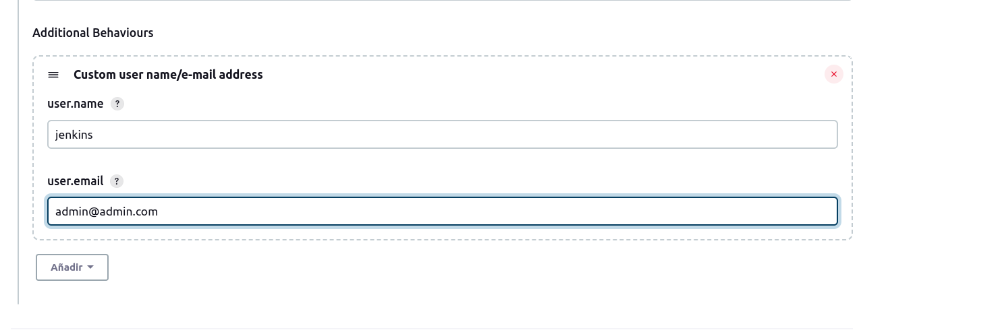
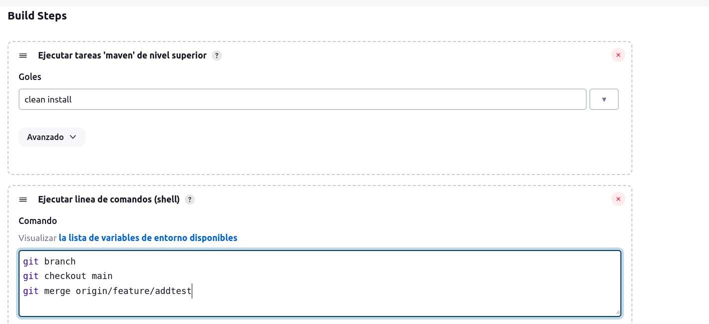
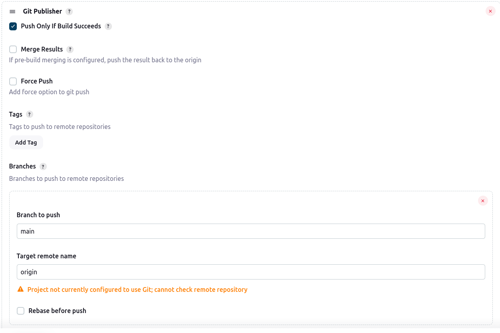

# Descripción

Este proyecto es usado como ejemplo de ci donde una vez se realice la integracion correctamente se haga el merge en el repositorio remoto en la rama main.

## Configuracion de pipeline
1. Configurar el pipeline de tal modo que no sea automatico (sin disparadores)
2. Agregar el sgte apartado en el pipeline ya que jenkins hara un push en el repositorio remoto y debe autenticarse como cliente:



3. Agregar en build steps los sgtes comandos para que haga merge a la rama principal(se debe tener en cuenta que el pipeline descargara cambios de la rama feature/addtest):
```shell
git branch
git checkout main
git merge origin/feature/addtest
```



4. Agregar ejecuciones finales en la seccion Acciones para ejecutar después., para que se pushee el cambio del merge una vez el build con las pruebas fue ejecutada correctamente



## Notas
- Para tomar el flujo se debe hacer el push del cambio y activar manualmente el pipeline en jenkins.
- Este ejemplo ha sido integrado con slack para el envio de notificaciones para ello se debe instalar el plugin en jenkins y seguir pasos dados por slack en la pagina web.